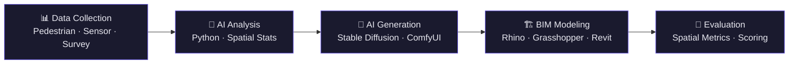



# 👋 Louis Ding (丁俊晖)

### Architecture × AI × Digital Fabrication

*Architecture senior @ Huaqiao University · Hong Kong Permanent Resident*

---

## 🎯 About Me

> **Architecture senior @ Huaqiao University · Hong Kong Permanent Resident**
>
> I'm an architecture student passionate about the intersection of **Artificial Intelligence**, **Computational Design**, and **Digital Fabrication**.
>
> Currently in my final year, applying for graduate programs at **Tsinghua, PKU, Fudan, and HKU**, focusing on AI-assisted architectural design and intelligent construction.

<table>
<tr><td width="50%">

### 🧠 Research Interests

- 🤖 AI-assisted Architectural Design
- 🧩 Parametric Modeling & Computational Geometry
- 🖨 Digital Fabrication & 3D Printing
- 🔄 BIM Automation & Workflow Optimization
- 🏗 Intelligent Construction Systems

</td><td width="50%">

### 🎓 Graduate Targets

| School | Program | Status |
|--------|---------|--------|
| 🏛 **Tsinghua University** | Architecture / AI Design | 🎯 Applying |
| 🏛 **Peking University** | Architecture / Urban Computing | 🎯 Applying |
| 🏛 **Fudan University** | Design / Smart City | 🎯 Applying |
| 🏛 **HKU** | MArch / Digital Architecture | 🎯 Applying |

🇭🇰 *Hong Kong Permanent Resident — eligible for local student status at HKU*

</td></tr>
</table>

---

## 🚀 Research Pipeline

---

## 🛠️ Skills & Tools

<table>
<tr>
<td width="25%" align="center">

### 🏗 Architecture

<code>Rhino 7</code>
<code>Grasshopper</code>
<code>Revit</code>
<code>Blender</code>
<code>AutoCAD</code>

</td>
<td width="25%" align="center">

### 💻 Programming

<code>Python</code>
<code>C++</code>
<code>JavaScript</code>
<code>Linux</code>

</td>
<td width="25%" align="center">

### 🤖 AI / ML

<code>PyTorch</code>
<code>Stable Diffusion</code>
<code>ComfyUI</code>
<code>ControlNet</code>

</td>
<td width="25%" align="center">

### 🖨 Fabrication

<code>3D Printing</code>
<code>Bambu Lab</code>
<code>G-code</code>
<code>ROS2</code>

</td>
</tr>
</table>

---

## 📂 Research Portfolio

<table>
<tr>
<td width="50%">

### 🔬 AI-Architecture-Research
*Python · Stable Diffusion · Rhino · Revit*

AI-assisted campus spatial optimization — from human behavior data to AI generation to BIM modeling.

</td>
<td width="50%">

### 🖨 Parametric-3D-Printing
*Grasshopper · Cura · 3D Printing*

Computational geometry → digital fabrication pipeline for parametric wall systems.

</td>
</tr>
<tr>
<td width="50%">

### 🔄 BIM-Automation
*Python · Revit API · Dynamo*

Revit automation tools for room scheduling, space optimization, and family generation.

</td>
<td width="50%">

### 🧩 Grasshopper-Experiments
*C# · Rhino · Grasshopper*

Computational geometry explorations: Voronoi tessellations, panelization, mesh relaxation.

</td>
</tr>
<tr>
<td width="50%">

### 🤖 ROS2-Robotic-Architecture
*Python · ROS2 · UR5*

Industrial robot toolpath planning and simulation for robotic fabrication in architecture.

</td>
<td width="50%">

### 🧠 Arch-Spatial-Intelligence
*Python · ML · Spatial Analysis*

Spatial analysis toolkit — graph theory, isovist analysis, and ML for data-driven design decisions.

</td>
</tr>
</table>

---

## 📊 GitHub Activity

---

## 📬 Get In Touch

📧 [luisdingww@gmail.com](mailto:luisdingww@gmail.com) · 💬 WeChat: **louis__heree**

---

*Architecture · AI · Digital Fabrication*

*建築 · 人工知能 · デジタルファブリケーション*

⭐ *If you find my work interesting, feel free to connect!*

